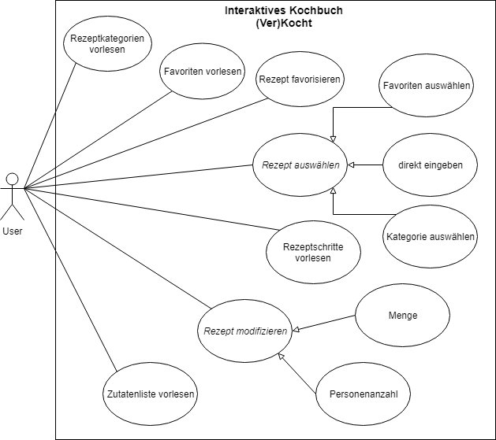

# Alexa Skill (Ver)Kocht!
Bei unserem Amazon Alexa Skill handelt es sich um ein interaktives Kochbuch.
Die Idee dahinter ist, dass sich in der Küche oftmals die Situation ergibt, mal eben keine Hand frei zu haben und so auf bequeme und einfache Weise ein gewünschtes Rezept aufrufen zu können.

## Key-Features
Nach dem Aufrufen des Skills mithilfe des Intends "Verkocht" ergeben sich für den User folgende Möglichkeiten:
* Vorlesen von Rezepten
* Favorisieren von Rezepten
* Modifizieren von Rezepten
* Filter von Rezepten nach deren Kategorien

## Methode
Zur Entwicklung des Projekts wird eine agile Methode der Softwareentwicklung verwendet.

## Status

"Verkocht!" wurde mithilfe von Models und Handlern realisiert.
Der Programmcode wurde während der Sprints sowohl durch Spracheingabe, als auch durch Mockito- und JUnit-Tests auf Funktionalität getestet.

## Use Cases

## Anwendungsfalldiagramm
