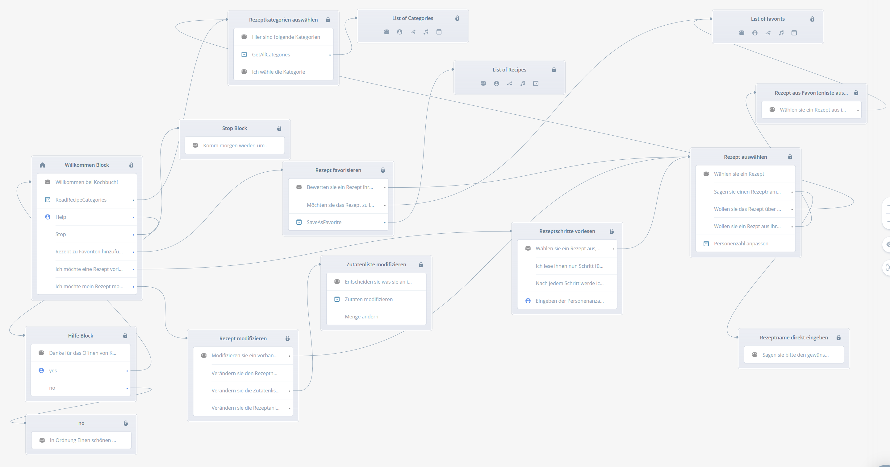
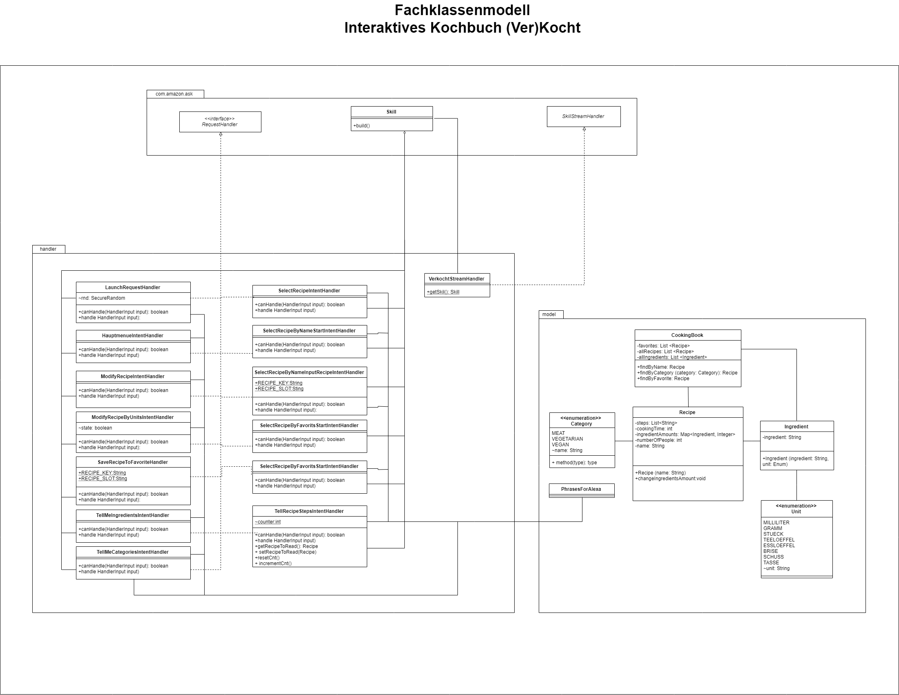
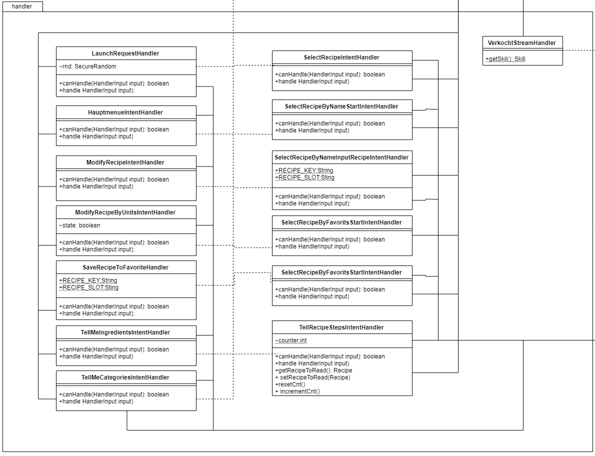
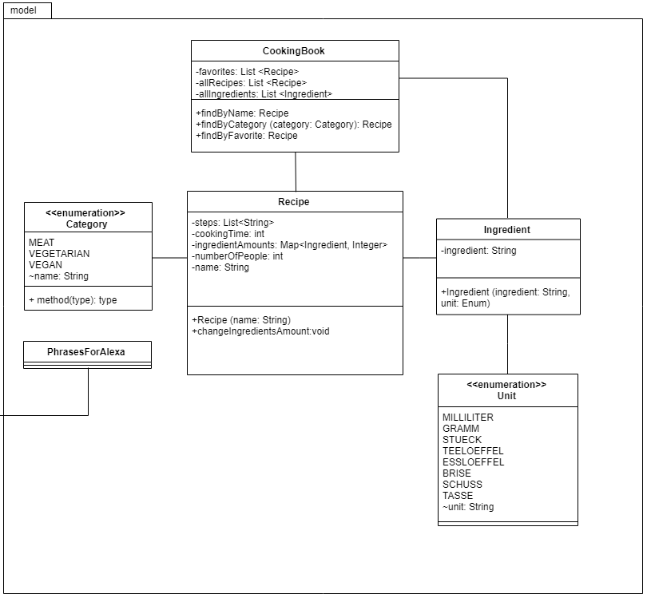
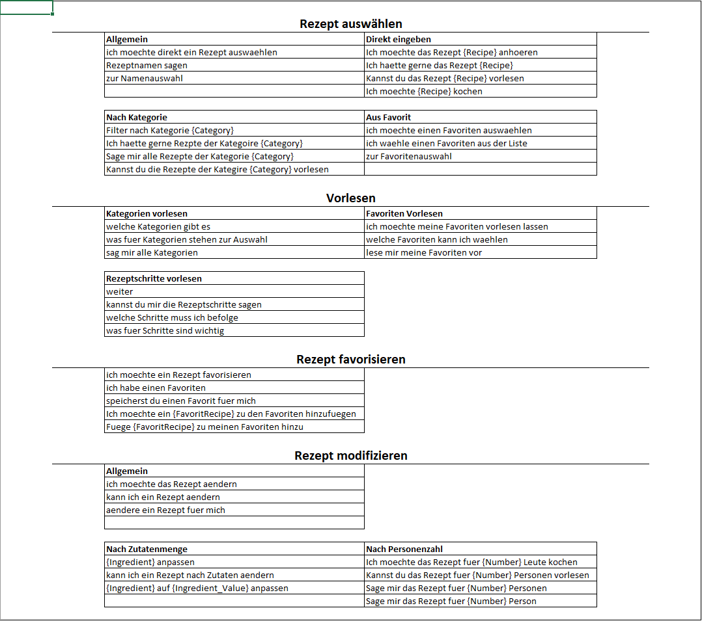



# Alexa Skill (Ver)Kocht!
Bei unserem Amazon Alexa Skill handelt es sich um ein interaktives Kochbuch.
Die Idee dahinter ist, dass sich in der Küche oftmals die Situation ergibt, mal eben keine Hand frei zu haben und so auf bequeme und einfache Weise ein gewünschtes Rezept aufrufen zu können.

Alle Informationen und Fortschritte während unserer Projektphase können auf unserer [Wiki-Seite](https://github.com/sweIhm-ws2018-19/skillproject-di-3/wiki) nachgeschlagen werden.

## Key-Features
Nach dem Aufrufen des Skills mithilfe des Intends "Verkocht" ergeben sich für den User folgende Möglichkeiten:
* Vorlesen von Rezepten
* Favorisieren von Rezepten
* Modifizieren von Rezepten
* Filtern von Rezepten nach deren Kategorien

## Methode
Zur Entwicklung des Projekts wird eine agile Methode der Softwareentwicklung verwendet.

## Status

"Verkocht!" wurde mithilfe von Models und Handlern realisiert.
Der Programmcode wurde während der Sprints sowohl durch Spracheingabe, als auch durch Mockito- und JUnit-Tests auf Funktionalität getestet.

## Use Cases

## Storyline

## Anwendungsfalldiagramm

## Intents und Intent-Samples

## User-Stories und deren Background
Am Beispiel:

|Name der User Story|User Story|Akzeptanzkriterien|
|---|---|---|
|Menge|Als User will ich ein Rezept aufgrund einer gegebenen Menge einer Zutat modifizieren, um eine angepasste Zutatenliste zu erhalten.|* Rückgabe des korrekt modifizierten Rezepts|

Am Beispiel der User-Story "Menge" lässt sich sehr gut darstellen, wie eine Implementierung abhängig von Vorherigen, schrittweise in ein Projekt eingearbeitet wird.
Vorher musste die User-Story "Rezept auswählen" vollständig fertig gestellt werden. Nach Abschluss der User-Stories im ersten Sprint, konnte nun "Menge" hinzugefügt werden.
Hierbei wird ein bereits ausgewähltes Rezept z.B. mittels des Befehls "ich möchte das Rezept nach Mengen anpassen" anhand einer Zutat und alle anderen Zutaten relativ dazu angepasst und für den User gespeichert.

Bei erfolgreichem Ausführen dieser Handlung erhält der User eine entsprechende Ausgabe.

## Erfahrungen und Eindrücke
Jannik: "Der Zeitaufwand bei der Verwaltung der verschiedenen Dienste und Seiten erwies sich als relativ hoch, was die Zusammenarbeit erschwerte. Allerdings lässt sich sagen, dass die Benutzung von github, nach einer angemessenen Einarbeitungszeit, eine positive Auswirkungen auf die Teamarbeit hatte."

Olga: "github hat mir gut gefallen. Die Modellierung und das Erstellen von Diagrammen fand ich bei großen Projektteilen sehr sinnvoll. Bei den kleinereren Issues, wie etwa den einzelnen User-Stories bin ich gegenteiliger Meinung. Die Teamarbeit hat sich zeitweise als nicht einfach herausgestellt."

Florian: "Die Verwendung von SCRUM war für mich eine positive Erfahrung. Hierbei ließen sich die Zwischenziele wie gewünscht einteilen und die Zusammenarbeit wurde dadurch, im Vergleich zu einer normalen Projektarbeit, sehr vereinfacht. Die Teamarbeit war zwischenzeitlich recht holprig - am Ende wurden wir aber mit dem Projekt fertig."

Finn: "Die Arbeit mit GitHub, TravisCI, Mockito und Sonarqube hatte definitv einen positiven Mehrwert. Alexa und AWS fand ich persönlich problematisch, da es immer wieder Probleme mit der Toolchain gab und die Coverage für Java sehr mangelhaft ist. Das Arbeiten mit SCRUM fand ich in dem kleinen und engen Rahmen etwas deplatziert."

